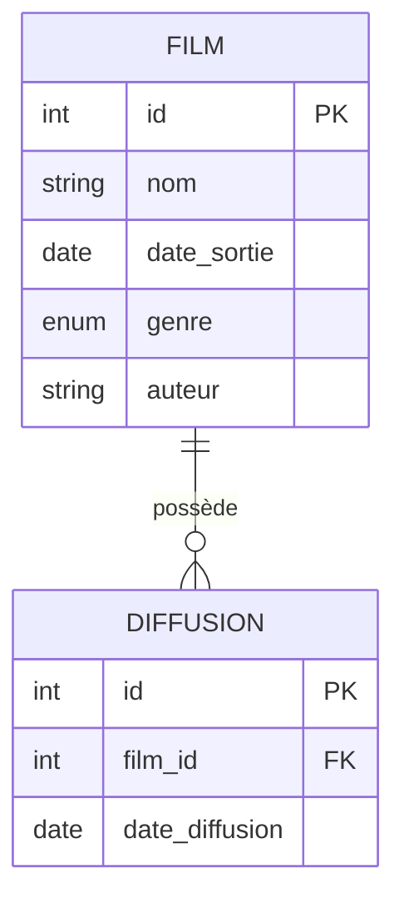

# Synopsis

Cette application permet de rechercher, consulter et gérer des films et leurs diffusions. Chaque film possède des informations détaillées et peut être associé à plusieurs diffusions.

# Fork du template
1. Forkez le dépôt GitHub du projet de base.
`https://github.com/CHAOUCHI/module-4-mvc-allocine`

# Diagramme Entity Relation



# Cahier des charges

| Taches                         | Description                                                                 | Cas critique                                      |
|------------------------------- |-----------------------------------------------------------------------------|---------------------------------------------------|
| Création d’un film             | Ajouter un nouveau film                                                     | Données invalides, doublon                        |
| Liste des films                | Afficher tous les films enregistrés                                         | Aucun film existant                               |
| Détail d’un film               | Afficher les détails d’un film et ses diffusions associées                  | Film inexistant, diffusions manquantes            |
| Section Ajouter une diffusion  | Ajouter une nouvelle diffusion à un film                                    | Film inexistant, date invalide                    |
| Liste des diffusions           | Afficher toutes les diffusions d’un film                                    | Film inexistant, aucune diffusion                 |
| Suppression d’un film          | Supprimer un film et ses diffusions associées                               | Film inexistant, suppression en cascade           |
| Recherche de film              | Rechercher un film par nom, genre, auteur, date de sortie                   | Aucun résultat, recherche trop large/étroite      |

# Entity
Exemple d'entités PHP pour les tables `Film` et `Diffusion` :
```php
class FilmEntity {
    private int $id;
    private string $nom;
    private DateTime $date_sortie;
    private string $genre;
    private string $auteur;

    // Getters et Setters...
}
```

```php
class DiffusionEntity {
    private int $id;
    private int $film_id;
    private DateTime $date_diffusion;
    // Getters et Setters...
}
```

> ***Astuce DateTime en PHP***
>```php
>$date = new DateTime();
>var_dump($date->format('H:i:s'));
>// string(8) "18:16:16"
>```